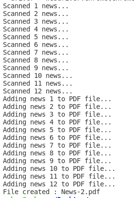

# News Scrapper with Python and Selenium WebDriver


news-scrapper is a educational project. It scrappes data from a news page. The data that is being scrapped : 

* News url
* News title
* News content
* News image

## Installation

Selenium needs to be installed first. Use the following command: 

```bash
pip install selenium
```
Used WebDriverManager to ease the driver setup process. Use the following command to install WebDriverManager

```bash
pip install webdriver-manager
```

## Usage

Just run the following command

```bash
python3 scrapper.py
```


## Output

Console output is going to be like this : 



A pdf file will be created on root folder. Here is a sample of that :


